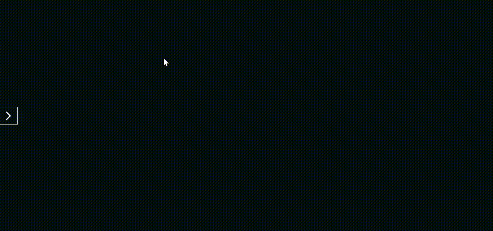

[](/license.txt)

## Table of contents
- [How to use](#how-to-use)
- [Demo](#demo)
- [Technologies](#technologies)
- [Functionality](#functionality)
- [Support](#support)
- [License](#license)

# Accessible Offcanvas Panel [🔝](#table-of-contents)

A simple and accessible side navigation panel built with HTML, CSS, and JavaScript.  
Useful for adding hidden menus or extra content without disturbing the main page layout.

## Functionality

- Toggle a side panel using a single accessible button
- Close the panel by pressing the `Escape` key
- Close the panel by clicking outside of it
- Uses semantic HTML and ARIA attributes for accessibility
- Includes smooth transitions and keyboard navigation support

## Demo
[]()

## How to use

Clicking the arrow on the left side of the screen will show the side navigation panel. Clicking it again will close it.
You can also close it by pressing the 'Escape' key or clicking outside it.

## How to locally run the project

1. Clone the repository.
```bash
git clone https://github.com/irmaodoguilherme/offcanvas.git
```

2. Navigate to the project's folder.
```bash
cd offcanvas
```

3. Run it locally using LiveServer in VSCode.

> Alternative: Double click the `index.html` file.

## Technologies

- JavaScript
- HTML
- CSS

## Support [🔝](#table-of-contents)
You can contact me through [contatoguilherme83@gmail.com](mailto:contatoguilherme83@gmail.com).

I accept any recommendations regarding the application. I'd be happy to add a little piece of every new idea so another person could study it.

Any found bugs can and should be reported through the `issues` section.

## License [🔝](#table-of-contents)

This project is licensed under the [MIT License](/license.txt)